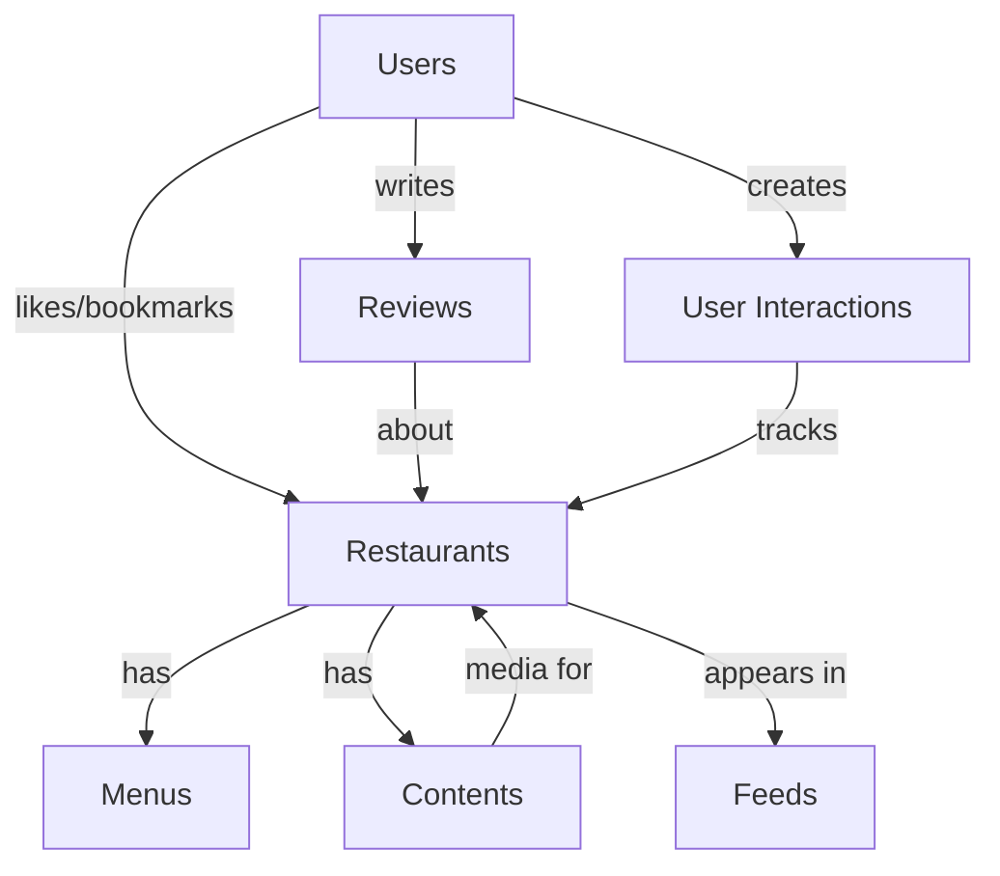

# 🗄️ 데이터베이스 설계

## 📊 데이터베이스 아키텍처

### 메인 데이터베이스: PostgreSQL
- 구조화된 음식점 정보
- 트랜잭션 보장
- 복잡한 쿼리 지원

### 캐시 레이어: Redis
- 세션 관리
- 실시간 조회수
- 인기 콘텐츠 캐싱

### 파일 스토리지: S3/NCP Object Storage
- 이미지/비디오 파일
- CDN 연동

## 📋 테이블 스키마

### 1. restaurants (음식점)
```sql
CREATE TABLE restaurants (
    id UUID PRIMARY KEY DEFAULT gen_random_uuid(),
    business_id VARCHAR(20) UNIQUE NOT NULL,  -- 사업자등록번호
    name VARCHAR(100) NOT NULL,
    category VARCHAR(50) NOT NULL,
    sub_category VARCHAR(50),
    description TEXT,
    
    -- 주소 정보
    address_full VARCHAR(255) NOT NULL,
    address_city VARCHAR(50) NOT NULL,
    address_district VARCHAR(50) NOT NULL,
    address_street VARCHAR(100),
    zip_code VARCHAR(10),
    latitude DECIMAL(10, 8) NOT NULL,
    longitude DECIMAL(11, 8) NOT NULL,
    
    -- 연락처 정보
    phone VARCHAR(20),
    website VARCHAR(255),
    email VARCHAR(100),
    
    -- 영업 정보
    business_hours JSONB,  -- {"mon": "10:00-22:00", ...}
    holiday_info VARCHAR(255),
    parking_available BOOLEAN DEFAULT false,
    
    -- 평가 정보
    rating_avg DECIMAL(2, 1) DEFAULT 0,
    rating_count INTEGER DEFAULT 0,
    review_count INTEGER DEFAULT 0,
    
    -- 가격 정보
    price_range INTEGER CHECK (price_range BETWEEN 1 AND 4),  -- 1: $, 2: $$, 3: $$$, 4: $$$$
    avg_price INTEGER,
    
    -- 메타 정보
    view_count INTEGER DEFAULT 0,
    like_count INTEGER DEFAULT 0,
    share_count INTEGER DEFAULT 0,
    bookmark_count INTEGER DEFAULT 0,
    
    -- 상태 및 타임스탬프
    status VARCHAR(20) DEFAULT 'active',  -- active, inactive, closed, pending
    is_verified BOOLEAN DEFAULT false,
    source VARCHAR(50),  -- 데이터 출처
    
    created_at TIMESTAMP WITH TIME ZONE DEFAULT CURRENT_TIMESTAMP,
    updated_at TIMESTAMP WITH TIME ZONE DEFAULT CURRENT_TIMESTAMP,
    deleted_at TIMESTAMP WITH TIME ZONE,
    
    -- 인덱스를 위한 필드
    popularity_score DECIMAL(10, 2) DEFAULT 0,  -- 인기도 점수 (정렬용)
    
    CONSTRAINT valid_coordinates CHECK (
        latitude >= -90 AND latitude <= 90 AND
        longitude >= -180 AND longitude <= 180
    )
);

-- 인덱스
CREATE INDEX idx_restaurants_category ON restaurants(category);
CREATE INDEX idx_restaurants_location ON restaurants(latitude, longitude);
CREATE INDEX idx_restaurants_city_district ON restaurants(address_city, address_district);
CREATE INDEX idx_restaurants_popularity ON restaurants(popularity_score DESC);
CREATE INDEX idx_restaurants_status ON restaurants(status);
CREATE INDEX idx_restaurants_created_at ON restaurants(created_at DESC);
```

### 2. menus (메뉴)
```sql
CREATE TABLE menus (
    id UUID PRIMARY KEY DEFAULT gen_random_uuid(),
    restaurant_id UUID NOT NULL REFERENCES restaurants(id) ON DELETE CASCADE,
    
    name VARCHAR(100) NOT NULL,
    description TEXT,
    price INTEGER NOT NULL,
    discount_price INTEGER,
    
    category VARCHAR(50),  -- 전채, 메인, 디저트, 음료 등
    tags TEXT[],  -- {'인기', '추천', '신메뉴', '비건'}
    
    image_url VARCHAR(500),
    thumbnail_url VARCHAR(500),
    
    is_available BOOLEAN DEFAULT true,
    is_popular BOOLEAN DEFAULT false,
    is_recommended BOOLEAN DEFAULT false,
    is_new BOOLEAN DEFAULT false,
    
    allergen_info TEXT[],  -- 알레르기 정보
    nutrition_info JSONB,  -- 영양 정보
    
    display_order INTEGER DEFAULT 0,
    
    created_at TIMESTAMP WITH TIME ZONE DEFAULT CURRENT_TIMESTAMP,
    updated_at TIMESTAMP WITH TIME ZONE DEFAULT CURRENT_TIMESTAMP,
    
    CONSTRAINT positive_price CHECK (price > 0)
);

CREATE INDEX idx_menus_restaurant ON menus(restaurant_id);
CREATE INDEX idx_menus_available ON menus(is_available);
```

### 3. contents (콘텐츠 - 이미지/비디오)
```sql
CREATE TABLE contents (
    id UUID PRIMARY KEY DEFAULT gen_random_uuid(),
    restaurant_id UUID NOT NULL REFERENCES restaurants(id) ON DELETE CASCADE,
    
    type VARCHAR(20) NOT NULL,  -- image, video, story
    url VARCHAR(500) NOT NULL,
    thumbnail_url VARCHAR(500),
    
    title VARCHAR(200),
    caption TEXT,
    tags TEXT[],
    
    width INTEGER,
    height INTEGER,
    duration INTEGER,  -- 비디오 길이 (초)
    file_size INTEGER,  -- 파일 크기 (bytes)
    
    view_count INTEGER DEFAULT 0,
    like_count INTEGER DEFAULT 0,
    share_count INTEGER DEFAULT 0,
    
    display_order INTEGER DEFAULT 0,
    is_featured BOOLEAN DEFAULT false,
    
    created_at TIMESTAMP WITH TIME ZONE DEFAULT CURRENT_TIMESTAMP,
    updated_at TIMESTAMP WITH TIME ZONE DEFAULT CURRENT_TIMESTAMP
);

CREATE INDEX idx_contents_restaurant ON contents(restaurant_id);
CREATE INDEX idx_contents_type ON contents(type);
CREATE INDEX idx_contents_featured ON contents(is_featured);
```

### 4. users (사용자)
```sql
CREATE TABLE users (
    id UUID PRIMARY KEY DEFAULT gen_random_uuid(),
    
    -- 인증 정보
    email VARCHAR(255) UNIQUE,
    phone VARCHAR(20) UNIQUE,
    password_hash VARCHAR(255),
    
    -- 프로필 정보
    username VARCHAR(50) UNIQUE NOT NULL,
    display_name VARCHAR(100),
    profile_image VARCHAR(500),
    bio TEXT,
    
    -- 위치 정보
    last_latitude DECIMAL(10, 8),
    last_longitude DECIMAL(11, 8),
    preferred_city VARCHAR(50),
    preferred_district VARCHAR(50),
    
    -- 선호도 정보
    preferred_categories TEXT[],
    dietary_restrictions TEXT[],  -- 채식, 할랄, 알레르기 등
    price_preference INTEGER,  -- 1-4
    
    -- 활동 정보
    total_views INTEGER DEFAULT 0,
    total_likes INTEGER DEFAULT 0,
    total_bookmarks INTEGER DEFAULT 0,
    
    -- 계정 상태
    role VARCHAR(20) DEFAULT 'user',  -- user, admin, business
    status VARCHAR(20) DEFAULT 'active',  -- active, suspended, deleted
    email_verified BOOLEAN DEFAULT false,
    phone_verified BOOLEAN DEFAULT false,
    
    -- 설정
    notification_settings JSONB DEFAULT '{"push": true, "email": true}',
    privacy_settings JSONB DEFAULT '{"public_profile": true}',
    
    last_login_at TIMESTAMP WITH TIME ZONE,
    created_at TIMESTAMP WITH TIME ZONE DEFAULT CURRENT_TIMESTAMP,
    updated_at TIMESTAMP WITH TIME ZONE DEFAULT CURRENT_TIMESTAMP,
    deleted_at TIMESTAMP WITH TIME ZONE
);

CREATE INDEX idx_users_email ON users(email);
CREATE INDEX idx_users_phone ON users(phone);
CREATE INDEX idx_users_username ON users(username);
```

### 5. user_interactions (사용자 상호작용)
```sql
CREATE TABLE user_interactions (
    id UUID PRIMARY KEY DEFAULT gen_random_uuid(),
    user_id UUID NOT NULL REFERENCES users(id) ON DELETE CASCADE,
    restaurant_id UUID NOT NULL REFERENCES restaurants(id) ON DELETE CASCADE,
    
    type VARCHAR(20) NOT NULL,  -- view, like, bookmark, share
    content_id UUID,  -- 특정 콘텐츠에 대한 상호작용인 경우
    
    duration INTEGER,  -- 조회 시간 (초)
    source VARCHAR(50),  -- 유입 경로
    
    created_at TIMESTAMP WITH TIME ZONE DEFAULT CURRENT_TIMESTAMP,
    
    UNIQUE(user_id, restaurant_id, type)  -- 중복 방지
);

CREATE INDEX idx_interactions_user ON user_interactions(user_id);
CREATE INDEX idx_interactions_restaurant ON user_interactions(restaurant_id);
CREATE INDEX idx_interactions_type ON user_interactions(type);
CREATE INDEX idx_interactions_created ON user_interactions(created_at DESC);
```

### 6. reviews (리뷰)
```sql
CREATE TABLE reviews (
    id UUID PRIMARY KEY DEFAULT gen_random_uuid(),
    user_id UUID NOT NULL REFERENCES users(id) ON DELETE CASCADE,
    restaurant_id UUID NOT NULL REFERENCES restaurants(id) ON DELETE CASCADE,
    
    rating INTEGER NOT NULL CHECK (rating BETWEEN 1 AND 5),
    content TEXT,
    
    images TEXT[],  -- 리뷰 이미지 URLs
    
    helpful_count INTEGER DEFAULT 0,
    report_count INTEGER DEFAULT 0,
    
    is_verified BOOLEAN DEFAULT false,  -- 실제 방문 확인
    
    created_at TIMESTAMP WITH TIME ZONE DEFAULT CURRENT_TIMESTAMP,
    updated_at TIMESTAMP WITH TIME ZONE DEFAULT CURRENT_TIMESTAMP,
    deleted_at TIMESTAMP WITH TIME ZONE
);

CREATE INDEX idx_reviews_restaurant ON reviews(restaurant_id);
CREATE INDEX idx_reviews_user ON reviews(user_id);
CREATE INDEX idx_reviews_rating ON reviews(rating);
```

### 7. feeds (피드 - 숏폼 콘텐츠)
```sql
CREATE TABLE feeds (
    id UUID PRIMARY KEY DEFAULT gen_random_uuid(),
    restaurant_id UUID NOT NULL REFERENCES restaurants(id) ON DELETE CASCADE,
    
    -- 피드 메타데이터
    sequence_number SERIAL,  -- 피드 순서
    feed_date DATE DEFAULT CURRENT_DATE,
    
    -- 노출 가중치
    weight DECIMAL(5, 2) DEFAULT 1.0,
    
    -- 타겟팅
    target_categories TEXT[],
    target_locations TEXT[],
    target_age_groups TEXT[],
    
    -- 성과 지표
    impression_count INTEGER DEFAULT 0,
    engagement_rate DECIMAL(5, 2) DEFAULT 0,
    
    is_active BOOLEAN DEFAULT true,
    
    created_at TIMESTAMP WITH TIME ZONE DEFAULT CURRENT_TIMESTAMP,
    expires_at TIMESTAMP WITH TIME ZONE
);

CREATE INDEX idx_feeds_date ON feeds(feed_date DESC);
CREATE INDEX idx_feeds_sequence ON feeds(sequence_number);
CREATE INDEX idx_feeds_active ON feeds(is_active);
```

## 🔄 데이터 관계



## 📈 성능 최적화

### 파티셔닝 전략
```sql
-- 시간 기반 파티셔닝 (user_interactions)
CREATE TABLE user_interactions_2024_01 PARTITION OF user_interactions
    FOR VALUES FROM ('2024-01-01') TO ('2024-02-01');

-- 지역 기반 파티셔닝 (restaurants)
CREATE TABLE restaurants_seoul PARTITION OF restaurants
    FOR VALUES IN ('서울특별시');
```

### 인덱스 전략
1. **Primary Keys**: UUID with gen_random_uuid()
2. **Foreign Keys**: 모든 관계에 인덱스
3. **검색 필드**: category, location, tags
4. **정렬 필드**: created_at, popularity_score
5. **복합 인덱스**: (city, district), (lat, lng)

### 캐싱 전략
```redis
# 인기 음식점 캐싱
SET popular:restaurants:seoul JSON_DATA EX 3600

# 사용자 세션
SET session:user_id:xxx SESSION_DATA EX 86400

# 실시간 카운터
INCR view:restaurant:xxx
```

## 🔐 보안 고려사항

### 데이터 암호화
- 개인정보 필드 암호화 (AES-256)
- 패스워드 해싱 (bcrypt)
- 전송 구간 암호화 (TLS)

### 접근 제어
```sql
-- Row Level Security
ALTER TABLE restaurants ENABLE ROW LEVEL SECURITY;

CREATE POLICY restaurant_view_policy ON restaurants
    FOR SELECT USING (status = 'active' OR status = 'inactive');
```

## 🔄 백업 및 복구

### 백업 정책
- **일일 백업**: 전체 데이터베이스
- **시간별 백업**: 트랜잭션 로그
- **실시간 복제**: Master-Slave 구조

### 복구 절차
1. Point-in-Time Recovery (PITR)
2. Standby 서버 활성화
3. 백업 파일 복원

## 📊 모니터링 지표

### 성능 메트릭
- Query 응답 시간
- Connection pool 사용률
- Cache hit ratio
- Index 사용률

### 용량 메트릭
- 테이블 크기
- 인덱스 크기
- 로그 파일 크기
- 남은 디스크 공간